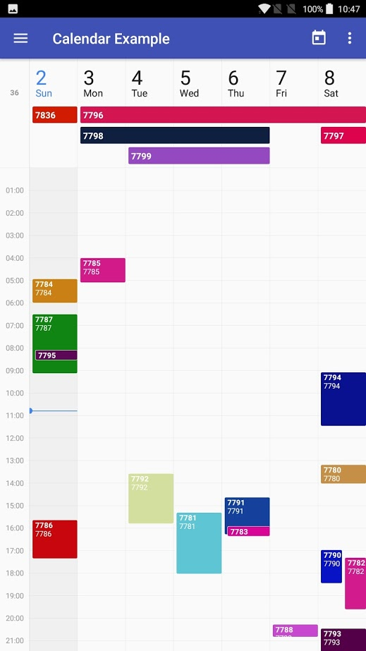
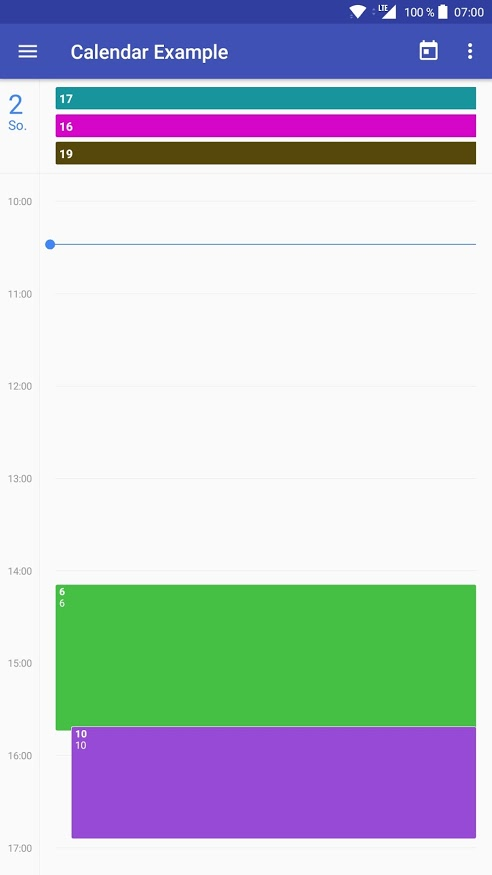
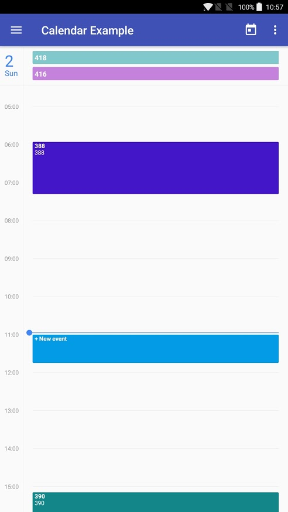

# Project Name : CalendarView

This library provides a Material Design CalendarView for Android (week and day view; more coming soon!). The default style is copied from the Google Calendar app, but almost everything is customizable.

| Screenshot of the [example app][example]  | Day view                                 | Add event by tapping empty space             |
| :---------------------------------------: | :--------------------------------------: | :------------------------------------------: |
|  |  |  |


- [CalendarView](#calendarview)
  - [Features](#features)
  - [Usage](#usage)
  - [Sample](#sample)
  - [Customization](#customization)
  - [Changelog](#changelog)

## Component Name :Features

- Week and Day views
- Scroll and zoom
- All-day events (and events > 24h) shown at the top
- All colors and most spacings are [customizable](#customization)


## Component Objective :Usage

1. Add the library to your gradle script

  ```groovy
    implementation project(path: ':calendar')
  ```

2. Add CalendarView in you layout

  ```xml
  <com.jonaswanke.calendar.CalendarView
      android:id="@+id/calendar"
      android:layout_width="match_parent"
      android:layout_height="match_parent"
      app:range="week" />
  ```

  Currently supported ranges are `week` and `day`. More coming soon!

3. Provide events to the view

  ```kotlin
  calendar.eventRequestCallback = { week ->
      // Retrieve events synchronously or asynchronously
      val events: List<Event> = // ...
      calendar.setEventsForWeek(week, events)
  }
  ```

  `CalendarView` currently caches two views for either side of the current view (e.g. two weeks to the left and two to the right) for smooth swiping. When a new view is loaded, `eventRequestCallback` will be called with the new week.  
  You should then supply events *starting* in that week by calling `calendar.setEventsForWeek()` (multi-day and multi-week events are always stored where they begin and will then be distributed to where they are required).

  You can call `calendar.setEventsForWeek()` anytime you want. The events will be cached and used when required. Old events starting in that week are overridden.

  Events implement the following properties:

  ```kotlin
  val title: String // Displayed in bold
  val description: String? // Optional; shown in a second line
  @get:ColorInt
  val color: Int? // Optional background color
  val start: Long // Start time
  val end: Long // End time
  val allDay: Boolean // Whether the event takes all day. If so, start and end are just used to determine the day
  ```

4. Add your listeners (optional)

  ```kotlin
  calendar.onEventClickListener = { event ->
      // Event was clicked
      Toast.makeText(this, "${event.title} clicked", Toast.LENGTH_LONG).show()
  }
  calendar.onEventLongClickListener = { event ->
      // Event was long clicked
      Toast.makeText(this, "${event.title} long clicked", Toast.LENGTH_LONG).show()
  }
  ```

  As shown in screenshot 3 (above), the user can add events by tapping empty space inside `CalendarView`. This only works when an `onAddEventListener` is set.

  ```kotlin
  calendar.onAddEventListener = { addEvent ->
      // User tried to create a new event. addEvent is an event with populated start and end.
      Toast.makeText(this, "Add event at ${start}", Toast.LENGTH_SHORT).show()
      // Return true to remove the placeholder
      true
  }
  ```


## Sample

There is also a [sample app][example] to get you started.

##Deliver By

Jigar Shah 


## Changelog

See [here][changelog] for the changelog.

[example]: ./example
[changelog]: ./CHANGELOG.md

<h1>Bugs and Feedback</h1>

For bugs, questions and discussions please use the Github Issues.

<br>
<h1>License</h1>

Copyright (c) 2018 Intuz Solutions Pvt Ltd.
<br><br>
Permission is hereby granted, free of charge, to any person obtaining a copy of this software and associated documentation files (the "Software"), to deal in the Software without restriction, including without limitation the rights to use, copy, modify, merge, publish, distribute, sublicense, and/or sell copies of the Software, and to permit persons to whom the Software is furnished to do so, subject to the following conditions:
<br><br>
THE SOFTWARE IS PROVIDED "AS IS", WITHOUT WARRANTY OF ANY KIND, EXPRESS OR IMPLIED, INCLUDING BUT NOT LIMITED TO THE WARRANTIES OF MERCHANTABILITY, FITNESS FOR A PARTICULAR PURPOSE AND NONINFRINGEMENT. IN NO EVENT SHALL THE AUTHORS OR COPYRIGHT HOLDERS BE LIABLE FOR ANY CLAIM, DAMAGES OR OTHER LIABILITY, WHETHER IN AN ACTION OF CONTRACT, TORT OR OTHERWISE, ARISING FROM, OUT OF OR IN CONNECTION WITH THE SOFTWARE OR THE USE OR OTHER DEALINGS IN THE SOFTWARE.

<h1></h1>
<a href="http://www.intuz.com">

</a>
